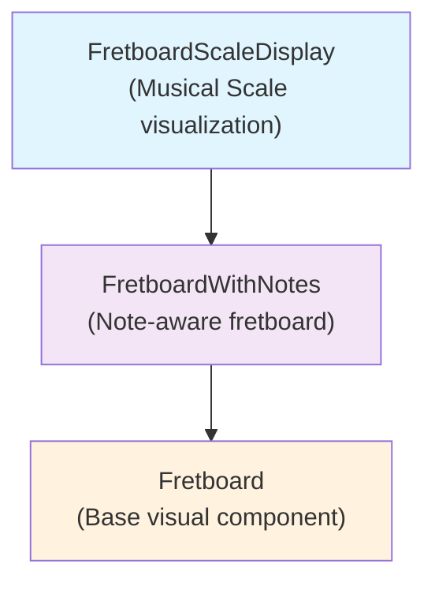

# 🎸 Rust Guitar Practice App

A comprehensive guitar learning companion built with **Rust**, **Leptos**, and **Axum**. Features interactive SVG fretboard visualization, practice exercises, session tracking, and full-stack architecture.

## 🚀 Quick Start

**One command to rule them all:**
```bash
./x dev
```

That's it! Your app will be running at:
- 🎨 **Frontend**: http://127.0.0.1:3010  
- 🔧 **Backend API**: http://127.0.0.1:8080

## 📋 Development Commands

The `./x` script makes development easy:

```bash
./x dev       # Start both frontend + backend
./x frontend  # Frontend only (Leptos/WASM)
./x backend   # Backend only (Axum API)
./x test      # Run all tests
./x check     # Code quality checks
./x build     # Production build
```

**VS Code Integration:** Use `Ctrl+Shift+P` → "Tasks: Run Task" → pick a task

## 🏗️ Architecture

**4-crate workspace** with clean separation:
- `shared/` - Domain models (exercises, music theory)
- `backend/` - Axum REST API with CRUD endpoints  
- `frontend/` - Leptos WASM app with SVG fretboard
- `xtask/` - Cross-platform development automation

### Current Features

- **Exercise Management** - Create, edit, and organize practice exercises
- **SVG Fretboard System** - Scalable and interactive fretboard display
- **Scale Visualization** - Display scales with different note highlighting  
- **Configurable** - Support for different instruments and fret ranges

### SVG FretboardArchitecture

The SVG fretboard system is built in layers:



Each layer adds functionality while maintaining the same visual output.

> **Documentation Note:** Consider using the [simple-mermaid](https://docs.rs/simple-mermaid/latest/simple_mermaid/) crate for adding [Mermaid](https://mermaid-js.github.io/mermaid/#/) diagrams to Rust docs for better architectural overviews.


## 🎯 What's Next

**Frontend ↔ Backend Integration**
- HTTP client integration
- Seamless API communication with localStorage fallback
- Real-time exercise synchronization


### Future Ideas

#### Fretboard Training Exercises
- Switch english and german note system
- Find notes on the fretboard
- Find interval of note
- Find scales
- Find chord shapes (relative to a given note)
- Show scales (triads, modes)

#### Circle of Fifths
Interactive circle of fifths with drag & drop exercises:
- Fill empty circle of fifths
- Place scales in correct positions
- Increasing difficulty with specific ordering requirements

#### Advanced Features
- **Tuner** - Audio input for tuning assistance
- **Metronome** - Configurable drum beats and timing
- **Ear training** - Audio-based exercises
- **Chord book** - Progress tracking for chord knowledge
- **Chords in a key** - Key-based chord relationships
- **MIDI/Keyboard input** - Use keys 1-7 to play scale degrees


## 🛠️ Setup Options

### Option 1: VS Code Dev Container (Recommended)
1. Install VS Code + Docker + Dev Containers extension
2. Clone repo and open in VS Code
3. `Ctrl+Shift+P` → "Dev Containers: Rebuild and Reopen in Container"
4. Run `./x dev`

### Option 2: Manual Setup
```bash
# Install Rust + tools
curl --proto '=https' --tlsv1.2 -sSf https://sh.rustup.rs | sh
rustup target add wasm32-unknown-unknown
cargo install trunk

# Clone and run
git clone https://github.com/ReeezZ/rust_guitar_app.git
cd rust_guitar_app
./x dev
```

## How xtask Works

The `./x` script is a simple wrapper around our custom xtask runner:

```bash
# What ./x does internally:
./x dev  →  cargo run --package xtask -- dev
```

**Benefits:**
- ✅ **Cross-platform** - Works on Windows, Linux, macOS
- ✅ **Type-safe** - Written in Rust, fully debuggable  
- ✅ **Coordinated startup** - Backend starts first, then frontend
- ✅ **Proper cleanup** - Ctrl+C stops both services cleanly

**Architecture:**
- `xtask/` crate handles all development automation
- Services coordinate startup timing and shutdown
- VS Code tasks integrate seamlessly
- No shell script brittleness

**Development Workflow:**
- Make changes → auto-reload in browser
- Run `./x test` before committing
- Follow Rust formatting (`cargo fmt`)
- Use `cargo clippy` for linting

**Project Structure:**
```
rust_guitar_app/
├── shared/      # Domain models & music theory
├── backend/     # Axum REST API server
├── frontend/    # Leptos WASM frontend  
├── xtask/       # Development automation
└── x            # Quick command wrapper
```

## 📚 References & Inspiration

**Guitar Learning Tools:**
- [fretmap.app](https://fretmap.app/) - Modern fretboard visualization
- [Fretonomy](https://www.fretonomy.com/) - Guitar learning platform

**Technical References:**
- [Leptos Book](https://leptos.dev/) - Reactive web framework
- [Axum Documentation](https://docs.rs/axum/) - Web application framework
- [SVG Guitar Tutorials](https://www.youtube.com/watch?v=C6VLedW5Dwk) - Fretboard visualization

**Tech stack ideas**
- [tailwindcss-animated](https://github.com/new-data-services/tailwindcss-animated) - for enhanced animations

## License

**GNU General Public License v3.0** - see [LICENSE](./LICENSE)
