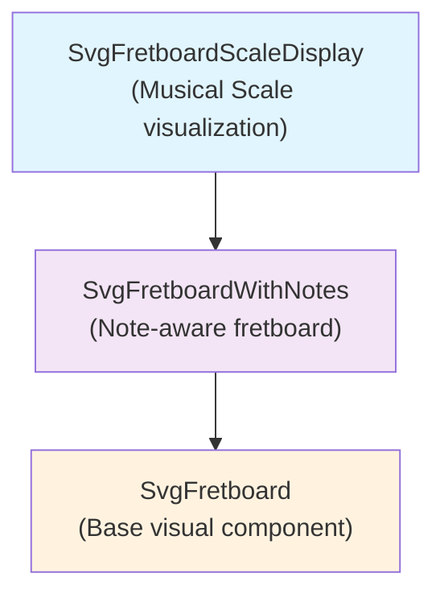

# Rust Guitar App

A guitar learning companion app built with Rust and Leptos. This project aims to create a free and open-source guitar practice tool with interactive SVG-based fretboard visualizations.

## Current Status

The project has working SVG fretboard components and scale visualization. Currently migrating from legacy components to the new SVG system.

### Features

- **SVG Fretboard System** - Scalable and interactive fretboard display
- **Scale Visualization** - Display scales with different note highlighting  
- **Configurable** - Support for different instruments and fret ranges

### SVG FretboardArchitecture

The SVG fretboard system is built in layers:



Each layer adds functionality while maintaining the same visual output.

> **Documentation Note:** Consider using the [simple-mermaid](https://docs.rs/simple-mermaid/latest/simple_mermaid/) crate for adding [Mermaid](https://mermaid-js.github.io/mermaid/#/) diagrams to Rust docs for better architectural overviews.

## Getting Started

### VS Code Dev Container (Recommended)

1. **Prerequisites:** VS Code, Docker, Dev Containers extension
2. **Setup:** 
   ```bash
   git clone https://github.com/your-username/leptos_stuff.git
   cd leptos_stuff
   code .
   ```
3. **Launch:** `Ctrl+Shift+P` → "Dev Containers: Rebuild and Reopen in Container"
4. **Run:** `RUSTFLAGS='--cfg getrandom_backend="wasm_js"' trunk serve --open`

### Manual Setup

```bash
# Install Rust and tools
curl --proto '=https' --tlsv1.2 -sSf https://sh.rustup.rs | sh
rustup target add wasm32-unknown-unknown
cargo install trunk leptosfmt

# Install Node.js and Tailwind
npm install -g tailwindcss

# Run the app
RUSTFLAGS='--cfg getrandom_backend="wasm_js"' trunk serve --open
```

## Current Status

### Working Features
- SVG fretboard visualization
- Scale display with note highlighting
- Interactive configuration  
- Range-based fret selection (`0..=5` syntax)


#### (Short term) tasks

- Switch between german and english note system


### Future Ideas

#### Fretboard Training Exercises
- Find notes on the fretboard
- Find interval of note
- Find scales
- Find chord shapes (relative to a given note)
- Show scales (triads, modes)

#### Circle of Fifths
Interactive circle of fifths with drag & drop exercises:
- Fill empty circle of fifths
- Place scales in correct positions
- Increasing difficulty with specific ordering requirements

#### Advanced Features
- **Tuner** - Audio input for tuning assistance
- **Metronome** - Configurable drum beats and timing
- **Ear training** - Audio-based exercises
- **Chord book** - Progress tracking for chord knowledge
- **Chords in a key** - Key-based chord relationships
- **MIDI/Keyboard input** - Use keys 1-7 to play scale degrees

## References

Inspiration and comparisons:
- [CodePen fretboard example](https://codepen.io/DreySkee/pen/bddpqM)
- [JS fretboard](https://github.com/metaescape/js-fretboard) 
- [fretmap.app](https://fretmap.app/)
- [Fretboard CSS tutorial](https://www.youtube.com/watch?v=C6VLedW5Dwk&list=PLXAhCH9FJ8zViqdqhsSP7iyCrVDoUGb3P&index=2)
- [Fretonomy](https://www.fretonomy.com/)

Tech stack ideas:
- [tailwindcss-animated](https://github.com/new-data-services/tailwindcss-animated) - for enhanced animations

## License

GNU General Public License v3.0 - see [LICENSE](./LICENSE)
